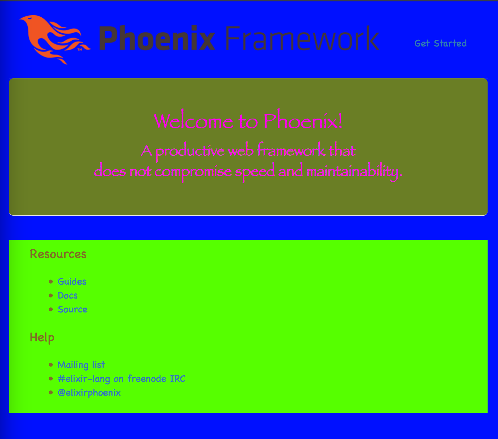

# Brunch Example

To start your Phoenix app:

  * Install dependencies with `mix deps.get`
  * Create and migrate your database with `mix ecto.create && mix ecto.migrate`
  * Install Node.js dependencies with `npm install`
  * Start Phoenix endpoint with `mix phoenix.server`

Now you can visit [`localhost:4000`](http://localhost:4000) from your browser.

## Configuring Brunch

Brunch is very simple; it is a pure asset builder - it takes static JS/CSS/etc,
and spits out compiled/transpiled versions into a specified folder. That's it.

For reference, it is worth reading the [Phoenix Guides page on static assets](http://www.phoenixframework.org/docs/static-assets), which explains how
Brunch is used with Phoenix. In Phoenix' case, Brunch looks in the `web/static`
folder, and compiles it to `priv/`, where the resultant files are made available
from the front end.

The [Brunch quickstart guide](http://brunch.io/docs/getting-started) is useful:
it is worth making a basic test project using that, just to see how it works.
There is also an [exhaustive community-written guide](https://github.com/brunch/brunch-guide)
which goes into a fair amount of detail.

---

In theory, this step should be _almost_ zero-config. Functionality in Brunch is
added via plugins; generally this is just a case of installing a plugin;
most of the time that's it, it should _just work_.

But sometimes a modification to `brunch-config.js` is necessary. To compare with
Rails' asset pipeline, most of the time you just put the _stuff_ in the required
places, but at times you may need to make changes inside the `config` folder, e.g.
modifying `config/initializers/assets.rb` to change how Rails deals with certain
filetypes.

For this example project, I am assuming that Rails-like functionality is wanted,
so automatic compilation of CoffeeScript for the scripts, and automatic compilation
of Scss for the styles. I am also including a JS library globally (JQuery).

### Preparation

[Node must be installed](https://nodejs.org/en/). With Brunch, you will install
JS dependencies via NPM (the Node Package Manager). NPM dependencies (an config)
is handled via the `package.json` file in the root of the project. Additional
Brunch-specific config can be added to `brunch-config.js`.

### Scss

By default, Phoenix includes the `brunch-css` plugin, which is set up to take
everything in `static/css`, concatenate it together, and spit it out as `app.css`
in the `priv/static.css` directory. But you'd like to have variables and mixins
and functions, so you want that Sass goodness.

This step is simple - just install the `sass-brunch` plugin by running
(in the root of the project):

```
npm install sass-brunch --save-dev
```

This will save it to `package.json` as a development dependency. Brunch automatically
uses installed Brunch plugin dependencies, so you should now be able to author
styles in `web/static/css` as `.scss` rather than `.css`.

> **NOTE** I have had a few issues with this plugin - sometimes it ends up
with the project just hanging, either on install, or when trying to run Phoenix.
If this happens, manually delete the `node_modules/` folder in the project, and
just run `npm install` again to rebuild it.


You can test that everything is working by:

1. converting `app.css` and `phoenix.css` to `app.scss` and `phoenix.scss` respectively.
2. running `mix phoenix.server`

Everything should look exactly the same as it did beforehand - Brunch will have
compiled the Scss files to `priv/static/css/app.css`.

You can add more Scss files in the `web/static/css` folder, and use them as normal.

To demonstate `@import` and Sass variables functioning, create a file called
`test.scss`, and at the top of `app.scss`, add

```
@import "test";
```

The import isn't strictly necessary - Brunch will just go ahead and compile your
Scss files to CSS and put them all together, but explicitly importing means you
can define what order they appear. The main `app` stylesheet is the last thing to
be concatenated, so anything there will appear at the end of the final stylesheet.

In `test`, add:

```
$disgusting-green: #56FF00;
$bluescreen-o-death: #0010FF;
$baby-poo: #6A7E25;
$awful-pink: #FF00EF;
$normal-poo: #806E28;

body {
  background-color: $bluescreen-o-death;
  color: $awful-pink;
  font-family: "Comic Sans", "Chalkboard", "Impact", monospaced;
}

.jumbotron {
  background-color: $baby-poo;
  font-family: "Papyrus", fantasy;
}

.main {
  background-color: $disgusting-green;
  color: $normal-poo;
}
```

The live reload should kick in once you save, giving you a far superior colour
scheme:




### CoffeeScript

Just like with Sass, add `coffee-script-brunch` plugin by running
(in the root of the project):

```
npm install coffee-script-brunch --save-dev
```

Now you can write CS, and Brunch will compile it to JS. **However** you **must**
`export` what you want to expose in your .coffee files, and `import` it into the main
`app.js` file in `web/static/js/`. The `app.js` file is used as the entry point
(similar to `application.js` in the Rails asset pipeline), and anything you
want exposed should be present there (though exceptions can be forced my modifying
  `brunch-config.js` - but I'll come to that).

Again, it is simple to demonstrate that CS compilation is now functioning properly.

Add a button to `web/templates/page/index.html.eex`:

```
<div class="jumbotron">
  <h2><%= gettext "Welcome to %{name}", name: "Phoenix!" %></h2>
  <p class="lead">A productive web framework that<br />does not compromise speed and maintainability.</p>
  <!-- Button added here: -->
  <button class="big-red-button">DON'T PRESS THIS BUTTON</button>
</div>

<div class="row marketing">
  ...
```

Add a CoffeeScript file - `web/static/js/test.coffee`, and to that add:

```
alertButtonHandler = (e) ->
  console.log("button clicked :(")
  alert("You clicked the button.")


redButtonClicker = (el) ->
  document.querySelector(el).addEventListener "click", alertButtonHandler

module.exports =
  redButtonClicker: redButtonClicker
```

**NOTE** the `module.exports = ...`. You **must** explicitly export what you're
going to use - brunch won't magically do it for you. `app.js` is the entry point,
and that file needs to know about those files (as with `application.js` in Rails).

**NOTE** Although CoffeeScript now supports (ES6+) `import` and `export`
declarations, using them throws an error; they don't get compiled down properly
by Babel. This puts you in a somewhat similar situation to Rails, which is
_waaay_ behind on JS modules. _I'll try to find a way around this - it seems
to just be a case of the CoffeeScript files not going through Babel properly?? Should
just be a case of altering the settings._

```
...
import "phoenix_html";
import { redButtonClicker } from "./test";

redButtonClicker(".big-red-button");
...
```

**NOTE** the `./` at the start of the imported file declaration - that indicates
you're importing a local file. If you missed that off, it would be assumed you were
were trying to import an installed NPM module, and errors would be thrown [as there
isn't an NPM package called 'test']. Note also that the _export_ in `test.coffee`
is a _default_ export - this allows the `import Test from ...`. For detail on
options here regarding JS module imports/exports, read [this very good Stack Overflow reply](http://stackoverflow.com/questions/36795819/when-should-i-use-curly-braces-for-es6-import/36796281#36796281).

Anyway, you should end up with something like this (I've added styling to the button):


**Go to the `step4/adding_global_scripts` branch for the next step →**
